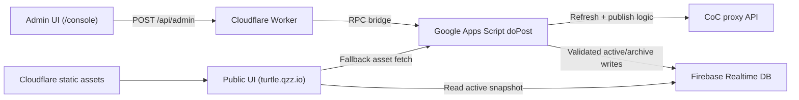

# TURTLE Clan Family Roster Platform

Production roster operations platform for Clash of Clans clan families.

This repository combines:
- A public roster + leaderboard website.
- A password-protected admin console for refresh/import/publish workflows.
- A backend refresh pipeline that syncs data from Clash endpoints.
- Reliable storage and archival snapshots in Firebase Realtime Database.

## Live Deployment

- Public site: [https://turtle.qzz.io](https://turtle.qzz.io)
- Admin console: [https://turtle.qzz.io/console](https://turtle.qzz.io/console)
- Source: [https://github.com/EmotionIce/CocRosterApp](https://github.com/EmotionIce/CocRosterApp)

## Recruiter Snapshot

This project demonstrates end-to-end product engineering in a real production setup:
- Full-stack architecture across browser, edge worker, backend APIs, and database.
- Data modeling + schema validation for non-trivial nested payloads.
- Operational reliability (locking, cooldowns, rollback behavior, archive retention).
- Mobile-first admin UX for non-technical content updates.
- Integration with external APIs (Clash data via proxy) under retry/rate-limit constraints.

## Core Capabilities

### Public website
- Landing page with modular content blocks driven by `publicConfig.profile`.
- Roster view with search and sectioned player lists.
- Leaderboard view with multiple sort modes and month toggles.
- Runtime fallback hydration (Firebase active snapshot first, asset route fallback second).

### Admin console (`/console`)
- Tabs: `Rosters`, `Import`, `Preview`, `Website`.
- Active snapshot loads automatically after unlock.
- Roster operations:
  - per-roster clan connection tests,
  - refresh-all pipeline,
  - lineup/stat sync,
  - bench/CWL tools,
  - publish with cooldown and locking.
- XLSX import compare/apply workflow.
- Website editor:
  - compact quick edits for commonly changed fields,
  - section-based editor (`General`, `Brand`, `Navigation`, `Hero`, `Journey`, `Family`, `War`, `CWL`, `Network`, `Proof`, `Final CTA`, `Media`, `Advanced JSON`),
  - repeater controls for ordered arrays,
  - advanced JSON escape hatch for exact override control.

### Backend pipeline
- Multi-step refresh pipeline with per-step rollback and issue aggregation.
- Supports both tracking modes: `cwl` and `regularWar`.
- CWL preparation and bench suggestion planner (`season_milp_v1`).
- Player metrics tracking and historical retention logic.
- Publish-time safeguards to prevent accidental metrics loss.

## Architecture



## Tech Stack

| Area | Implementation |
| --- | --- |
| Frontend | Vanilla HTML/CSS/JS (`cloudflarePages/index.html`, `client.js`, `admin.js`) |
| Admin import | XLSX parsing in browser (`cloudflarePages/generator.js`) |
| Edge/API bridge | Cloudflare Worker (`cloudflarePages/worker.js`) |
| Backend | Google Apps Script (`script/*.gs`) |
| Data store | Firebase Realtime Database (`active`, `archive/*`, `meta`) |
| External API | Clash data via `https://cocproxy.royaleapi.dev/v1` |

## Repository Structure

### Frontend + edge (`cloudflarePages/`)
- `index.html`: public shell (landing, rosters, leaderboard).
- `client.js`: public hydration, rendering, leaderboard/search/profile logic.
- `console.html` / `admin.html`: admin shells.
- `admin.js`: admin state machine and workflow orchestration.
- `generator.js`: XLSX import parsing, compare, and apply helpers.
- `public-config.js`: runtime config bootstrap and optional static overrides.
- `worker.js` / `_worker.js`: admin API proxy + admin route rewriting.
- `styles.css`: shared styles for public and admin surfaces.

### Backend (`script/`)
- `entrypoints.gs`: `doGet`/`doPost` handling and response helpers.
- `adminApi.gs`: RPC dispatch (`getRosterData`, `refreshAllRosters`, `publishRosterData`, etc.).
- `refreshEngine.gs`: refresh-all pipeline orchestration.
- `rosterSync.gs`: roster pool/lineup/stat sync.
- `warDomain.gs`: war/CWL aggregation + lifecycle/history sanitization.
- `benchPlanner.gs`: CWL bench planner and suggestion generation.
- `metricsTracking.gs`: player metrics enrichment and retention.
- `rosterSchema.gs`: schema validation + sanitization boundary.
- `firebaseStore.gs`: Firebase transport, active reads/writes, archive helpers.
- `authAndLocks.gs`: admin auth, publish cooldown, lock lifecycle.

## Data Contract

Published payload (`roster-data.json`) is schema-validated before write:

```json
{
  "schemaVersion": 1,
  "pageTitle": "Join the TURTLE Clan Family",
  "lastUpdatedAt": "2026-04-08T00:00:00.000Z",
  "publicConfig": {
    "landing": {
      "bannerMediaUrl": "https://...",
      "squareMediaUrl": "https://...",
      "discordInviteUrl": "https://..."
    },
    "profile": {
      "hero": { "title": "Your headline" },
      "family": { "metaTemplate": "{clanCount} clans, {playerCount} tracked players." },
      "importMappingSeeds": [
        { "clan": "YOUR CLAN NAME", "rosterId": "main-a" }
      ]
    }
  },
  "rosterOrder": ["main-a", "master-2-b"],
  "rosters": [
    {
      "id": "main-a",
      "title": "TURTLE Main",
      "connectedClanTag": "#CLANTAG",
      "trackingMode": "cwl",
      "main": [],
      "subs": [],
      "missing": [],
      "cwlPreparation": {
        "enabled": true,
        "rosterSize": 30,
        "lockStateByTag": {}
      }
    }
  ],
  "playerMetrics": {}
}
```

Notes:
- `publicConfig.profile` is sanitized recursively with safe-key guards.
- `publicConfig.landing.profile` is also accepted for compatibility.
- Empty/noisy overrides are pruned.

## Modular Family Customization (Current Implementation)

The project now supports config-driven family branding without backend changes.

### Recommended workflow
1. Open `/console` and unlock.
2. Go to `Website`.
3. Use Quick Edits for common updates:
   - page title,
   - Discord URL,
   - banner/square media URLs,
   - hero title,
   - primary CTA label.
4. Use section editors for structured copy updates.
5. Use `Advanced JSON` only when you need exact low-level control.
6. Publish from the command bar.

### Import mapping seeds
`importMappingSeeds` can be provided in profile JSON for XLSX clan-name auto-mapping:
- Array form: `{ "clan": "Clan Name", "rosterId": "main-a" }`
- Object form: `{ "CLAN_NAME": "main-a" }`

## Reliability and Safety Design

- Strict schema validation before publish (`validateRosterData_`).
- Duplicate roster/tag protection with diagnostics.
- Active job lock around refresh/publish to prevent concurrent mutation.
- Publish cooldown enforcement.
- Per-step refresh rollback on failure.
- Auto-refresh trigger management and run status tracking.
- Archive retention in Firebase:
  - publish backups (`archive/publish`, keep latest 10),
  - daily auto-refresh backups (`archive/autorefreshDaily`, keep latest 2).
- Public hydration fallback when primary source is unavailable.

## Deployment

### 1) Deploy Apps Script backend

Deploy `script/` as a web app and set Script Properties.
Recommended web app settings: execute as owner account, access allowed for the users who need to call it (the worker forwards requests to this endpoint).

Required Script Properties:
- `ADMIN_PW`
- `COC_API_TOKEN`
- `FIREBASE_DB_URL`
- `FIREBASE_CLIENT_EMAIL`
- `FIREBASE_PRIVATE_KEY`
- `FIREBASE_TOKEN_URI`

### 2) Deploy Cloudflare worker + static assets

Use `cloudflarePages/` with `worker.js` as entrypoint.

`wrangler.example.toml` is included as a baseline.

Recommended worker variable:
- `ROSTER_APPS_SCRIPT_URL=https://script.google.com/macros/s/<DEPLOYMENT_ID>/exec`

### 3) Verify runtime config

In `cloudflarePages/public-config.js`, confirm:
- `ROSTER_FIREBASE_DB_URL`
- `ROSTER_BASE_URL` (Apps Script URL, if needed for fallback)

### 4) Smoke test

1. Open `/console`, unlock, confirm active snapshot auto-loads.
2. Run refresh-all.
3. Validate roster/website changes in UI.
4. Publish and re-check public site (`/`).

## Operational Notes

- This repo is deployable as-is (no frontend build step).
- Cache-busting query params are used on script tags in HTML shells.
- `worker.js` and `_worker.js` are intentionally mirrored.
- `console.html` and `admin.html` are intentionally mirrored for admin route compatibility.

## Roadmap

Planned modularization enhancements:
- Profile template packs (import/export).
- Starter roster packs for new clan families.
- Guided tools for safe roster ID migration with historical continuity.

## License

See [LICENSE](LICENSE).
