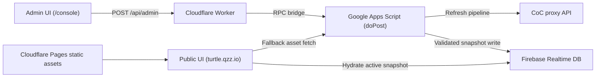

# TURTLE Clan Family Roster Platform

Production roster operations platform for Clash of Clans clan families.

## Live Deployment

- Public site: [https://turtle.qzz.io](https://turtle.qzz.io)
- Admin console: [https://turtle.qzz.io/console](https://turtle.qzz.io/console)
- Source: [https://github.com/EmotionIce/CocRosterApp](https://github.com/EmotionIce/CocRosterApp)

## What This Project Does

This app manages full clan-family roster operations from one workflow:

- Multi-roster management (add/remove/reorder rosters, per-roster clan tag + mode).
- Two tracking modes per roster: `cwl` and `regularWar`.
- Refresh pipeline against Clash endpoints (members, current war, war log, CWL league group).
- CWL preparation and bench planning (including lock-in and lock-out controls).
- Public roster + leaderboard site with loading/fallback behavior.
- Password-protected admin workflows for refresh, import, and publish.
- Auto-refresh scheduling and Firebase archival snapshots.

## Architecture



## Why The Implementation

- Strict roster schema validation and sanitization before writes (`script/rosterSchema.gs`).
- Duplicate tag/roster checks and deterministic `rosterOrder` normalization.
- Lock-based refresh/publish orchestration to prevent concurrent data corruption.
- Archived publish/auto-refresh snapshots in Firebase for recovery.
- Runtime fallbacks on the public client (Firebase first, then asset route).
- No build complexity: deployable source is plain HTML/CSS/JS + Apps Script.

## Repository Map

### Backend (`script/`)

- `entrypoints.gs`: Apps Script `doGet`/`doPost`, public redirect, admin API envelope.
- `adminApi.gs`: RPC dispatcher (`getRosterData`, `refreshAllRosters`, `publishRosterData`, etc.).
- `refreshEngine.gs`: orchestrates full refresh-all pipeline and issue summaries.
- `rosterSync.gs`: roster pool/lineup sync and tracking refresh logic.
- `warDomain.gs`: CWL + regular war aggregation and sanitization.
- `benchPlanner.gs`: CWL planner (`season_milp_v1`) and suggestion generation.
- `metricsTracking.gs`: retention and player history/metrics enrichment.
- `firebaseStore.gs`: Firebase transport, active snapshot writes, archive maintenance.
- `authAndLocks.gs`: admin auth + active roster job lock lifecycle.
- `rosterSchema.gs`: canonical data contract boundary.

### Frontend + Edge (`cloudflarePages/`)

- `index.html`: public shell (landing, rosters, leaderboard).
- `client.js`: public rendering, hydration, profile interactions.
- `console.html`: Cloudflare-hosted admin shell.
- `admin.js`: admin state machine and mutation workflows.
- `generator.js`: XLSX import parsing + compare/apply logic.
- `public-config.js`: runtime public/admin URL config.
- `worker.js` / `_worker.js`: admin proxy + route rewriting.
- `styles.css`: shared visual layer.

## Data Contract (Current)

`roster-data.json` is the published source of truth:

```json
{
  "schemaVersion": 1,
  "pageTitle": "Join the TURTLE Clan Family",
  "lastUpdatedAt": "ISO-8601",
  "publicConfig": {
    "landing": {
      "bannerMediaUrl": "https://...",
      "squareMediaUrl": "https://...",
      "discordInviteUrl": "https://..."
    }
  },
  "rosterOrder": ["main-a", "master-2-b"],
  "rosters": [
    {
      "id": "main-a",
      "title": "TURTLE Main",
      "connectedClanTag": "#CLANTAG",
      "trackingMode": "cwl",
      "main": [],
      "subs": [],
      "missing": [],
      "cwlPreparation": {
        "enabled": true,
        "rosterSize": 30,
        "lockStateByTag": {}
      }
    }
  ]
}
```

## Admin Workflow

1. Unlock admin UI (server-side password validation).
2. Load active config into preview.
3. Optionally import XLSX and compare/apply.
4. Refresh all rosters (pipeline runs by roster).
5. Review statuses and preparation outcomes.
6. Publish validated snapshot to Firebase active path + archive.

## Deployment Notes

1. Deploy `script/` as a Google Apps Script web app.
2. Configure Script Properties at minimum:
   - `ADMIN_PW`
   - `COC_API_TOKEN`
   - `FIREBASE_DB_URL`
   - `FIREBASE_CLIENT_EMAIL`
   - `FIREBASE_PRIVATE_KEY`
   - `FIREBASE_TOKEN_URI`
3. Deploy `cloudflarePages/` with Worker routing.
4. Ensure public runtime values are set (`ROSTER_FIREBASE_DB_URL`, `ROSTER_BASE_URL`).
5. Verify admin bridge path (`/api/admin`) and public hydration from Firebase.

## Modularization Roadmap (Next Step)

Current code already supports multiple rosters, but branding/content is still mostly TURTLE-specific in `cloudflarePages/index.html` and parts of `cloudflarePages/client.js`.

Next iteration will make this repo reusable for other clan families:

1. Expand `publicConfig` schema beyond URL-only values.
   - Add validated text fields for hero copy, section text, and CTA labels.
   - Keep backward compatibility with existing `publicConfig.landing.*Url`.
2. Move hardcoded landing copy into config-driven rendering.
   - Use existing `rosters` + `rosterOrder` as the dynamic base.
   - Keep static defaults only as fallback values.
3. Introduce a family profile template.
   - Add a documented starter config that a new clan can duplicate and edit.
   - Keep domain and media URLs isolated from logic.
4. Isolate "brand layer" from "operations layer".
   - Operations: refresh/publish/schema/metrics/bench planner remain generic.
   - Brand layer: text/media/theme values become per-family config.
5. Add migration + docs.
   - Document old-to-new config mapping.
   - Ensure existing TURTLE payloads continue to render without breaking.

## Development Notes

- No build step: committed files are deployable artifacts.
- Keep `script/` and `cloudflarePages/` behavior aligned when changing shared flows.
- `cloudflarePages/assets/` contains static media/icons used by both public and admin UI.

## License

See `LICENSE`.
